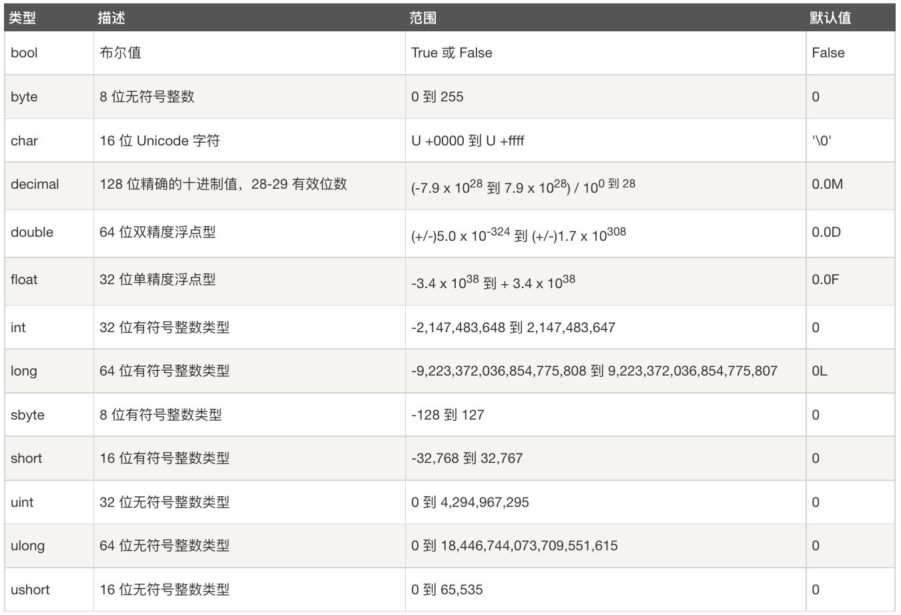

  <br>


### integer type
```
int max = int.MaxValue;
int min = int.MinValue;
Console.WriteLine($"The range of integers is {min} to {max}");
```

### decimal type
```
decimal min = decimal.MinValue;
decimal max = decimal.MaxValue;
Console.WriteLine($"The range of the decimal type is {min} to {max}");
```
```
decimal c = 1.0M;
decimal d = 3.0M;
Console.WriteLine(c / d);
```


### double type
```
double max = double.MaxValue;
double min = double.MinValue;
Console.WriteLine($"The range of double is {min} to {max}");
```
```
double a = 1.0;
double b = 3.0;
Console.WriteLine(a / b);
```
